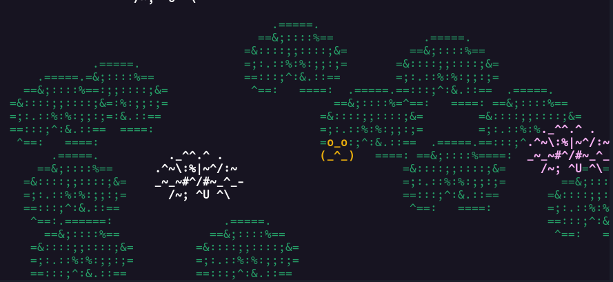

# Pond, a soothing in-terminal idle screen
A software that simulates a little pond, complete with flowering lilypads and adorable little frogs jumping around.

## Screenshots
Example of a pond:



The frog says hi!


## Features
- frogs
- the most advanced frog AI in the market
- collect rare frogs!
- frogs have deep and unique personalities
- please be kind with the frogs and don't scare them
- non-resizable window

## How to use pond??
Just type `pond` after installing it and you're set! Use `q` to leave the pond.

If you want more info and some options to play with, try `pond --help`!

## This is too adorable, how do I make this my terminal screensaver??
The only way I found is to use a terminal multiplexer. Here's how to set `pond` as your screensaver:

### If you use tmux:
In `~/.tmux.conf`: 

```bash
set -g lock-after-time 60
set -g lock-command "pond -s"
```

### If you use screen for some reason:
In your `~/.screenrc`:

```bash
idle 60 blanker
blankerprg pond -s
```

## How to build

### Dependencies
In addition to the build essentials, you need the `curses` library to build this project. On Debian-based distributions, you can install them both with `sudo apt install build-essential ncurses-dev`.

### Compilation
- Unix & unix-like systems:

```bash
git clone https://gitlab.com/alice-lefebvre/pond/
cd pond
make && sudo make install
pond # enjoy!
```

If you don't want/can't `sudo`, you can also just run `make`, and run the program with `bin/pond`.

- If you're on another OS, you're on your own, sorry.

## Contributing
Contributions are welcome! If you do want to contribute, please do keep those things in mind:
- If you add new options, make sure that the help message doesn't wrap on standard 80 columns terminals
- I can't guarantee that I'll merge any change you make! If you want to make sure beforehand, feel free to send me an email @ `alice.lefebvre.cool@proton.me`
Thank you for considering contributing!
