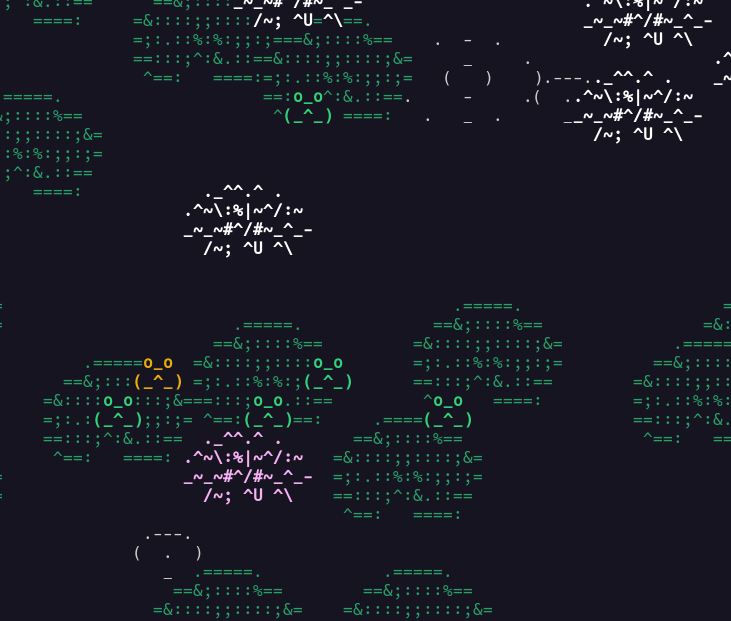

# Pond, a soothing in-terminal idle screen
A software that simulates a little pond, complete with flowering lilypads. If you observe very quietly, you might just spot some wildlife!

## Screenshots
Example of a pond:



Hi !


## Features
- frogs
- the most advanced frog AI in the market
- collect rare frogs!
- please be kind with the frogs and don't scare them
- non-resizable window

## How to build

### Dependencies
In addition to the build essentials, you need the `curses` library to build this project. On Debian-based distributions, you can install them both with `sudo apt install build-essential ncurses-dev`.

### Compilation
If you're on a Linux distro, you can probably get away with:

```bash
git clone https://gitlab.com/alice-lefebvre/pond/
cd pond
sudo make install
pond # enjoy!
```

If you don't want/can't `sudo`, you can also just run `make`, and run the program with `bin/pond`.

If you're on another OS, you're on your own, sorry.
